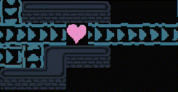
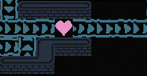
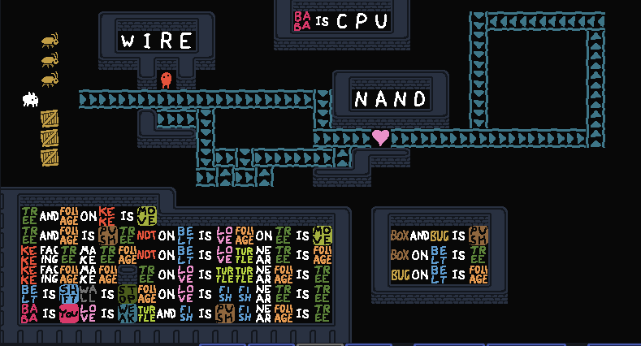

# Baba Is CPU
This is going to be an unusual blogpost for me.  
Recently I got back into the game [Baba Is You](https://en.wikipedia.org/wiki/Baba_Is_You). If you don't know the game - I *highly* recommend it.  
In this blogpost, I am going to show to one might use the game mechanics to build a CPU.

## What is Baba Is You?
Baba Is You is a [Sokoban](https://en.wikipedia.org/wiki/Sokoban)-style puzzle game. It features 2 dimentional levels, in each of them you can manipulate various objects to eventually reach a goal.  
Unlike Sokoban, however, the rules that make up the game are also blocks that could be manipulated.

### Rules
The rules of the game come in a complex format, which I will not be methodically analyzing here. Here is a hand-wavy description though:
- Basic rules look like `OBJECT IS ADJECTIVE`, like `WALL IS STOP` (which makes walls non-pushable) or `BOX IS PUSH` (which makes box pushable).
- There is also `BABA IS YOU` which controls the character, but won't be super-relevant for this blogpost.
- You can also use `OBJECT IS OBJECT`, which is used quite a lot during the game. For example, `FLAG IS KEY` turns all flag objects into keys.
- There are conditional rules, like `BUG ON TREE IS FLAG` (turns the bug into a flag if placed on a tree) or `BUG FACING KEY IS WALL` (when the bug's orientation directly looks at at key, it turns into a wall).
- There are `AND` and `NOT` clauses. For example, `NOT BUG IS YOU` means you control every type of object in the game except bugs, and `BUG IS NOT YOU` would prevent you from creating `BUG IS YOU`.
- There are certain verbs that affect what the object does. For example, `KEY IS MOVE` makes keys move (according to their orientation).

The game highly abuses those mechanics - for example, breaking a `WALL IS STOP` to move through walls or turning `WALL IS YOU` to move *as the wall*.  
As the game progresses, things become more "meta", but I do not want to spoil anything and it's not super relevant for this blogpost anyway.

#### Gameplay
Here is an example of how the rules are used (and sometimes abused) - courtesy of [Wikipedia](https://en.wikipedia.org/wiki/Baba_Is_You):  

Note how the player character breaked `WALL IS STOP` to make that rule not apply, to later escape.

### Level editor
I have used a [free level editor](https://hempuli.itch.io/baba-is-you-level-editor-beta) to play around with this experiment.  
Sadly, levels have a size limit of 33x8, but it's good enough for the purpose of building the basic building-blocks of a CPU.

## Designing a CPU
What do we need to "create" a CPU in software? Apparently not much! We only need the following receipe:
- A way to represent bits (`0` and `1`).
- A way to transmit bits (in `wires`). Note this includes splitting a wire into two, just like in electric circuits.
- [Functionally complete](https://en.wikipedia.org/wiki/Functional_completeness) gates. For the same of simplicity - being able to implement a [NAND gate](https://en.wikipedia.org/wiki/NAND_gate).

Everything else (ALU, registers, control units) could be implemented using those. I think that's pretty amazing!  
In fact, I highly recommend the course [From NAND to Tetris](https://www.nand2tetris.org) that shows exactly how to get to a full CPU from those 3 concepts.

### Previous work
I note previous work has been done on Baba Is You and Turing completeness - specifically [this paper](https://terra-docs.s3.us-east-2.amazonaws.com/IJHSR/Articles/volume5-issue7/IJHSR_2023_57_140.pdf) illustates it well.  
However, I wanted to present a different approach, mostly to show how to build logic gates rather than a Turing machine.  
I also believe the thought process is more interesting than the result, and that's what I'd like to share here.

### Bits in Baba Is You
I've decided to use objects as bits - specifically `FOLIAGE` as `0` and `TREE` as `1`.  
I think it's easy to remember since `TREE` sounds like `TRUE` and `FOLIAGE` sounds like `FALSE`.  
Here is what I had in mind (with `BELT` items at the bottom, more on that in the following section):  

### Wires in Baba Is You
The game offers a mechanism called `SHIFT`, "naturally" used by `BELT` (i.e. `BELT IS SHIFT`).  
Thus, wires are `BELT` objects with their orientation and *literally* carry bits around!  
However, splitting a signal \ bit in two means duplicating the bit. How could that be done? We need to duplicate objects out of thin air!  
My first candidate was using an adjective called `MORE`, which duplicates objects, and using it with a condition, e.g. `TREE NEAR KEKE IS MORE`.  
The problem is that `MORE` duplicates as much as possible in all 4 directions, and it was difficult to avoid creating *too many* objects.  
I've decided to use something else: use a condition (with `KEKE`, but I could have used anything else) and say that if it's facing `TREE` it'd `MAKE` a `TREE`, i.e. `KEKE FACING TREE MAKE TREE` (and a similar rule for the `FOLIAGE` object, of course).  
The problem is that `MAKE` is created at the same position as `KEKE` ("underneath" it), so I added `TREE AND FOLIAGE ON KEKE IS MOVE` which will move it away.  
Here is a nice example (I put a `TREE` in a `BOX` for the sake of demonstration):  

### Implementing a NAND Gate
Lastly, we'd like to implement a `NAND` gate, which is a `NOT` being done on an `AND` gate. Here is the [Truth Table](https://en.wikipedia.org/wiki/Truth_table) for NAND:  
| X     | Y     | Result |
| :---: | :---: | :----: |
| False | False | True   |
| False | True  | True   |
| True  | False | True   |
| True  | True  | False  |

The logic itself might not be super complicated, but there is one more issue - synchronization.  
We cannot rely on two bits arriving at the same time, nor can we rely on one arrivng early - they will arrive at an arbitrary order.  
So, my initial thought was to put the bits (`TREE`, `FOLIAGE`) on an empty space, make them only pushable on `BELT`, and based on the Truth table for NAND do certain things.  
However, I needed to make one of them disappear - normally I'd use a special object called `EMPTY` (which does exist in the game) - but alas, the editor does not have `EMPTY`!  
*Remark*: only much after did I realize there is an "advanced objects" option in the editor which does allow `EMPTY`... Anyway - my solution was already solid.  
So, instead of an empty space, I used a heart object (called `LOVE`). To synchronize, I added `LOVE IS WEAK` which means the first object that "steps" on it takes its place.  
At that point, all I needed was to implement the truth table in rules - which I couldn't do.  
I thought of adding something like `TREE FACING TREE IS FOLIAGE` (for `NAND(T, T) = F`) but it raises severe problems with wires - it means I must avoid having wires live side-by-side.  
Therefore, I've decided to introduce "states" to bits that are "pending" gate operations, and to keep the same fashion of `TRUE = TREE` and `FALSE = FOLIAGE`, I introduced `TURTLE` and `FISH`:  
| Bit   | Neutral state | Pending gate state |
| :---: | :-----------: | :----------------: |
| False | FOLIAGE       | FISH               |
| True  | TREE          | TURTLE             |

Basically, by adding `LOVE IS WEAK`, `TREE ON LOVE IS TURTLE` and `FOLIAGE ON LOVE IS FISH` I make the first bit that arrives the gate get into the pending gate state and replace `LOVE`.  
Also, to handle the case of bits arriving at the same time and ending up on top of each other - I introduced `FOLIAGE ON TREE IS MOVE` which will hasten `FOLIAGE` one step.
Now we can design the gate in a way that the "pending gate state" bit will be on the right side of the gate - that means we could add rules to implement the truth table:  
| Left bit | Right bit | Rule                        |
| :------: | :-------: | :-------------------------: |
| FOLIAGE  | FISH      | FISH NEAR FOLIAGE IS TREE   |
| FOLIAGE  | TURTLE    | TURTLE NEAR FOLIAGE IS TREE |
| TREE     | FISH      | FISH NEAR TREE IS TREE      |
| TREE     | TURTLE    | TURTLE NEAR TREE IS FOLIAGE |

Those rules essentially implement the truth table, and I can design the `BELT` objects in the gate to make the `TURTLE` or `FISH` to get pushed by the left bit (the 2nd bit to arrive).  
There is one problem left though - after the right bit is transformed, we are left with a "naked" `TREE` or `FOLIAGE` and we need to reset the gate and make them turn into `LOVE` again.  
Since they are not on a `BELT` - that is pretty easy - we add `TREE NOT ON BELT IS LOVE` and `FOLIAGE NOT ON BELT IS LOVE`.  
Here are animations showing `NAND` gate for all 4 options:

#### False NAND False

#### False NAND True

#### True NAND False

#### True NAND True

### Complete level data
Here is the complete level (I added labels on each of the components for clarity):  

I've also uploaded the level data (as [87level.l](87level.l) and [87level.ld](87level.ld)) to this repository.  
Note the rules on the left side are the core mechanics - the rule on the right, as well as the `BUG` and `BOX` items were created for demonstration purposes only.
